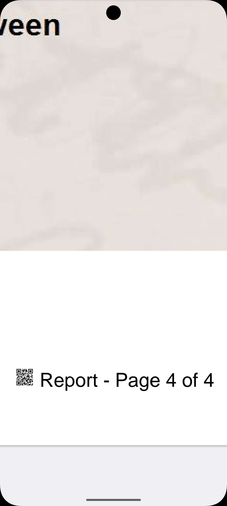
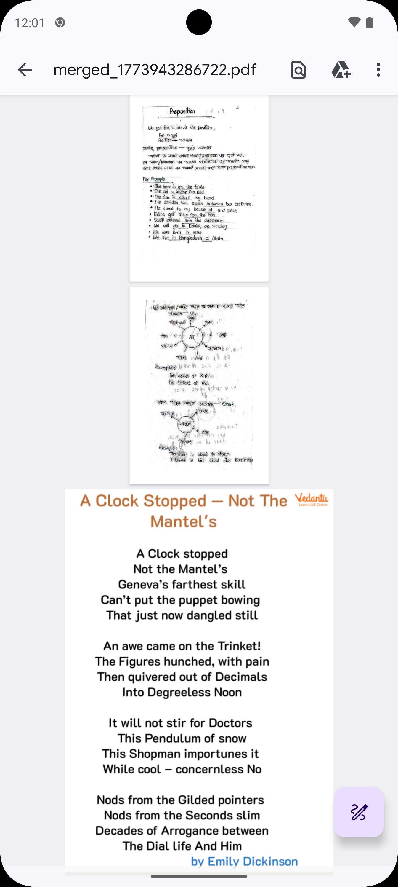
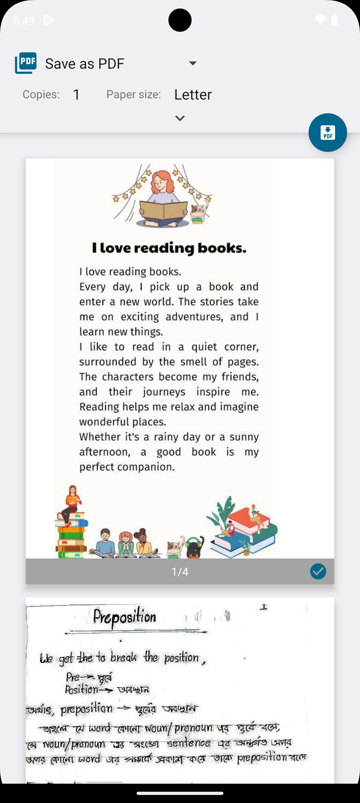
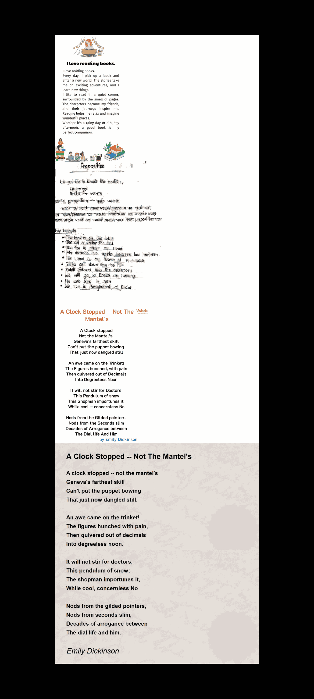

# pdf_utils

A comprehensive, standalone Flutter plugin for professional PDF manipulation and generation.

[](https://pub.dev/packages/pdf_utils)
[](https://dart.dev)
[](https://opensource.org/licenses/MIT)

[**Pub.dev**](https://pub.dev/packages/pdf_utils) | [**Repository**](https://github.com/rashbip/pdf_utils) | [**Issues**](https://github.com/rashbip/pdf_utils/issues) | [**Documentation**](doc/invoice_generation.md)

---

## Showcase

### 🎨 Creation & Design
| Invoice Generation | Image to PDF | Advanced Watermark |
| :---: | :---: | :---: |
|  |  |  |
| *Professional Invoices* | *Native Image-to-PDF* | *Advanced Branding* |

### 📄 Page Manipulation & Assembly
| Reorder & Delete | Insert Page/Image | Dynamic Numbering |
| :---: | :---: | :---: |
|  |  |  |
| *Page Reorganization* | *Flexible Insertion* | *Headers & Footers* |

| Merge PDFs | Split PDFs | Page Resizing |
| :---: | :---: | :---: |
|  |  |  |
| *Native High-Speed Merge* | *Selective Splitting* | *A4/Target Rescaling* |

### 🛠️ Utilities & Analysis
| Native Printing | PDF Compression | Security Status |
| :---: | :---: | :---: |
|  |  |  |
| *System Print Dialog* | *File Size Optimization* | *Permission Analysis* |

| Image Extraction | Long Image | Text Extraction |
| :---: | :---: | :---: |
|  |  |  |
| *Page to Image* | *Long Vertical Layouts* | *Robust Text Retrieval* |

## Features

- **Professional Invoice Generation**: Create stunning PDF invoices with customizable models and high-level styling.
- **Standalone Native Processing**: Powered by native `PDFBox` (Android) and `PDFKit` (iOS) for maximum performance and reliability. **Apache 2.0 / MIT Compliant.**
- **Smart PDF Resizing**: Rescale pages to match specific targets (like A4) while maintaining aspect ratio and centering.
- **Dynamic Page Numbering**: Add custom headers/footers with `{n}` and `{total}` tags and inline **`{image}`** support.
- **Advanced Watermarking**: Dynamic text and image branding with 9 placement options, opacity, and background support.
- **Native PDF Printing**: Open the standard system print dialog directly from your app.
- **Smart Blank Page Removal**: Automatically detect and strip empty pages from your document.
- **Page Manipulation**: Reorder, delete, rotate, and **Insert** (images or PDF pages) in a single pass.
- **PDF Extraction**: Efficiently extract high-quality page images and long vertical images.
- **Text & Metadata**: Powerful text extraction and metadata retrieval using `PDFDoc` with support for encrypted documents.
- **Security Analysis**: Retrieve detailed security permissions and validity via code.
- **Locking & Unlocking**: Protect PDF documents with passwords or remove them entirely.
- **Merging & Splitting**: Combine multiple PDFs or divide them by page ranges.
- **Optimized Image Conversion**: Both standard and highly optimized native image-to-PDF converters.

## Installation

Add `pdf_utils` to your `pubspec.yaml`:

```yaml
dependencies:
  pdf_utils: ^3.2.1
```

## Quick Start

### 1. Generating an Invoice

```dart
final invoice = Invoice(...);
File pdfFile = await PdfInvoiceGenerator.generate(invoice);
```

### 2. Merging PDFs

```dart
File merged = await PdfUtils.mergePdfFiles(
  filesPath: ['path1.pdf', 'path2.pdf'],
  outputFileName: 'combined_document',
);
```

### 3. Text Extraction

```dart
final doc = await PDFDoc.fromPath('doc.pdf');
String text = await doc.text;
print('Total pages: ${doc.length}');
```

### 4. PDF Protection

```dart
File locked = await PdfUtils.protectPdf(
  inputPath: 'doc.pdf',
  password: 'secret_password',
  outputFileName: 'secure_doc',
);
```

## Documentation

For more detailed guides, check out the [doc](doc/) directory:
- [Invoice Generation](doc/invoice_generation.md)
- [PDF Manipulation (Conversion, Merging, Security)](doc/pdf_manipulation.md)
- [Resizing & Scaling](doc/resizing.md)
- [Page Numbering & Headers](doc/page_numbering.md)
- [Text Extraction & Metadata](doc/text_extraction.md)

## Example App

Check the `example` folder for a complete demonstration of the plugin's features on real devices.

## License

This project is licensed under the MIT License - see the [LICENSE](LICENSE) file for details.
