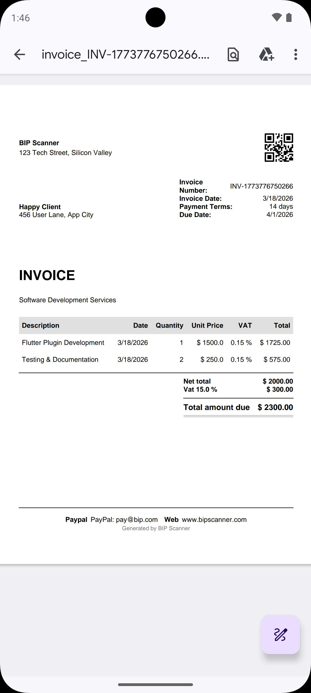
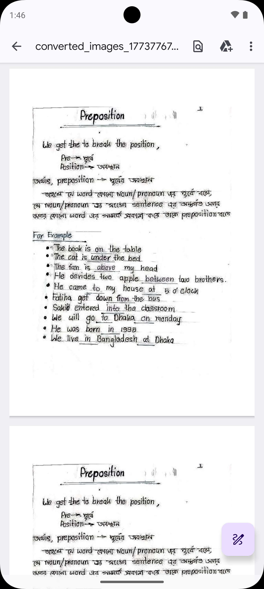

# pdf_utils

A comprehensive, standalone Flutter plugin for professional PDF manipulation and generation.

[](https://pub.dev/packages/pdf_utils)
[](https://dart.dev)
[](https://opensource.org/licenses/MIT)

[**Pub.dev**](https://pub.dev/packages/pdf_utils) | [**Repository**](https://github.com/rashbip/pdf_utils) | [**Issues**](https://github.com/rashbip/pdf_utils/issues) | [**Documentation**](doc/invoice_generation.md)

---

## Showcase

<p align="center">
  
  
  
</p>

## Features

- **Professional Invoice Generation**: Create stunning PDF invoices with customizable models and high-level styling.
- **Standalone Native Processing**: Powered by native `PDFBox` (Android) and `PDFKit` (iOS) for maximum performance and reliability.
- **PDF Extraction**: Efficiently extract high-quality page images and long vertical images.
- **Text & Metadata**: Powerful text extraction and metadata retrieval using `PDFDoc` with support for encrypted documents.
- **Security**: Lock and unlock PDF documents with password protection.
- **Merging & Splitting**: Merge multiple PDF files or choose specific pages from a document to combine.
- **Optimized Image Conversion**: Both standard (`pdf` package) and highly optimized native image-to-PDF conversion.

## Installation

Add `pdf_utils` to your `pubspec.yaml`:

```yaml
dependencies:
  pdf_utils: ^1.2.0
```

## Quick Start

### 1. Generating an Invoice

```dart
final invoice = Invoice(...);
File pdfFile = await PdfInvoiceGenerator.generate(invoice);
```

### 2. Merging PDFs

```dart
File merged = await PdfUtils.mergePdfFiles(
  filesPath: ['path1.pdf', 'path2.pdf'],
  outputFileName: 'combined_document',
);
```

### 3. Text Extraction

```dart
final doc = await PDFDoc.fromPath('doc.pdf');
String text = await doc.text;
print('Total pages: ${doc.length}');
```

### 4. PDF Protection

```dart
File locked = await PdfUtils.protectPdf(
  inputPath: 'doc.pdf',
  password: 'secret_password',
  outputFileName: 'secure_doc',
);
```

## Documentation

For more detailed guides, check out the [doc](doc/) directory:
- [Invoice Generation](doc/invoice_generation.md)
- [PDF Manipulation (Conversion, Merging, Security)](doc/pdf_manipulation.md)
- [Text Extraction & Metadata](doc/text_extraction.md)

## Example App

Check the `example` folder for a complete demonstration of the plugin's features on real devices.

## License

This project is licensed under the MIT License - see the [LICENSE](LICENSE) file for details.
