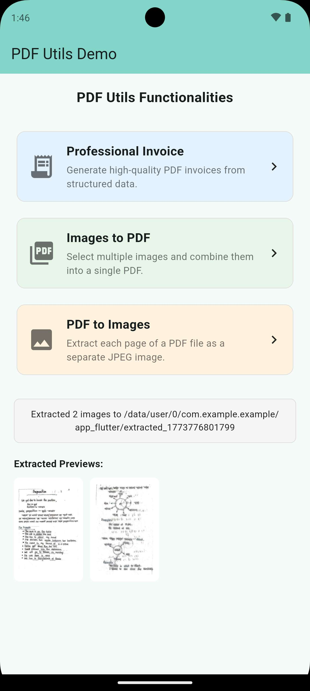

# pdf_utils

A comprehensive Flutter plugin for professional PDF manipulation and generation.

[](https://pub.dev/packages/pdf_utils)
[](https://dart.dev)
[](https://opensource.org/licenses/MIT)
[](https://github.com/rashbip/pdf_utils)

[**Pub.dev**](https://pub.dev/packages/pdf_utils) | [**Repository**](https://github.com/rashbip/pdf_utils) | [**Issues**](https://github.com/rashbip/pdf_utils/issues) | [**Documentation**](doc/invoice_generation.md)

---

## Showcase

<p align="center">
  
  
  
</p>

## Features

- **Professional Invoice Generation**: Create stunning PDF invoices with customizable models for suppliers, customers, and items.
- **Image to PDF**: Effortlessly convert a list of image paths into a single multipage PDF.
- **PDF to Image**: Extract PDF pages as high-quality JPEG images with progress tracking.
- **Customizable**: Add custom QR codes, logos, and currency symbols to your invoices.

## Installation

Add `pdf_utils` to your `pubspec.yaml`:

```yaml
dependencies:
  pdf_utils: ^1.0.0
```

## Quick Start

### 1. Generating an Invoice

```dart
final invoice = Invoice(
  supplier: Supplier(name: 'BIP Scanner', address: 'Tech Park', paymentInfo: 'paypal.me/bip'),
  customer: Customer(name: 'Client A', address: 'Main St'),
  info: InvoiceInfo(
    date: DateTime.now(),
    dueDate: DateTime.now().add(const Duration(days: 7)),
    description: 'Service Fee',
    number: '2024-001',
  ),
  items: [
    InvoiceItem(
      description: 'PDF Development',
      date: DateTime.now(),
      quantity: 1,
      vat: 0.1,
      unitPrice: 100.0,
    ),
  ],
);

File pdfFile = await PdfInvoiceGenerator.generate(invoice);
```

### 2. Images to PDF

```dart
File pdf = await PdfUtils.imagesToPdf(
  imagePaths: ['path1.jpg', 'path2.png'],
  outputFileName: 'my_document',
);
```

### 3. PDF to Images

```dart
List<String> images = await PdfUtils.pdfToImages(
  pdfPath: 'doc.pdf',
  outputDirectory: 'output/path',
  onProgress: (cur, total) => print('$cur/$total'),
);
```

## Documentation

For more detailed guides, check out the [doc](doc/) directory:
- [Invoice Generation](doc/invoice_generation.md)
- [PDF Manipulation (Conversion & Extraction)](doc/pdf_manipulation.md)

## Example App

Check the `example` folder for a complete demonstration of the plugin features.

## License

This project is licensed under the MIT License - see the [LICENSE](LICENSE) file for details.
