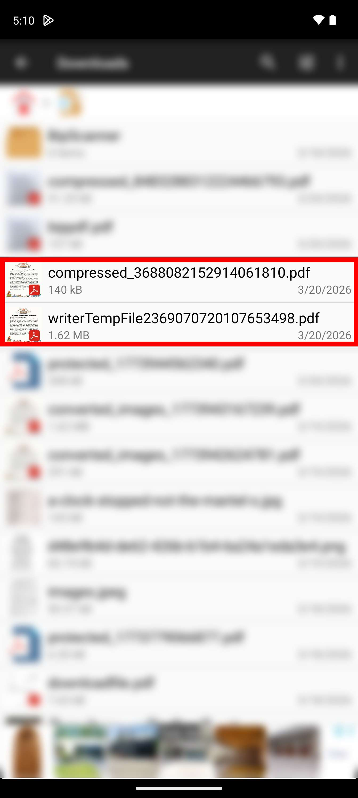

# PDF Compression

`pdf_utils` provides a way to compress PDF files by reducing image quality and scaling down images.


*Figure: Compressing PDFs to reduce file size.*

## Native Compression
You can shrink PDF files by optimizing internal images and removing unneeded embedded fonts.

```dart
import 'package:pdf_utils/pdf_utils.dart';

void compress() async {
  final compressedFile = await PdfUtils.compressPdf(
    filePath: '/path/to/large_doc.pdf',
    quality: 50,      // Image quality (0-100)
    scale: 0.7,        // Image scale factor (0.0-1.0)
    unEmbedFonts: true, // Set true to remove embedded fonts for extra savings
  );
  
  if (compressedFile != null) {
    print('Compressed PDF saved at: ${compressedFile.path}');
  }
}
```

### Parameters
- `quality`: JPEG compression quality for internal images (default: 80).
- `scale`: Scaling factor for images (default: 1.0).
- `unEmbedFonts`: Whether to remove font embedding from the document (default: false).
