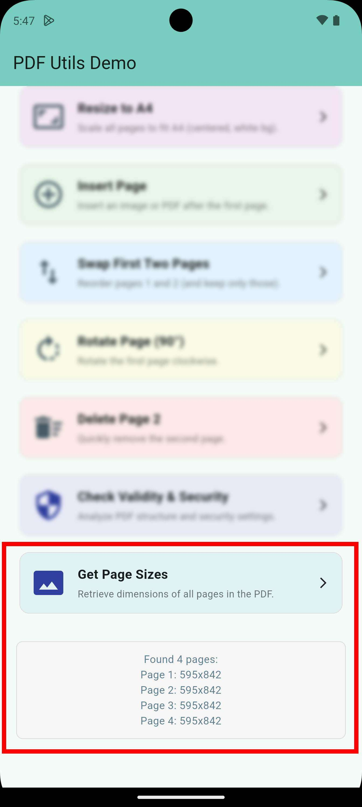

# PDF Info & Analysis

The `pdf_utils` plugin provides tools to analyze PDF structure and page dimensions.

## Page Sizes & Dimensions

`pdf_utils` provides a way to get the dimensions of all pages in a PDF file.


*Figure: Retrieving the width and height of every page in a PDF.*

```dart
import 'package:pdf_utils/pdf_utils.dart';

void getSizes() async {
  final sizes = await PdfUtils.getPagesSize('/path/to/my_doc.pdf');
  
  if (sizes.isNotEmpty) {
    for (var size in sizes) {
      print('Page ${size.pageNumber}: ${size.width}x${size.height}');
    }
  }
}
```

## PDF Metadata
Extract standard metadata and page counts from your documents.

```dart
void getInfo() async {
  final count = await PdfUtils.getPageCount('/path/to/my_doc.pdf');
  final info = await PdfUtils.getDocInfo('/path/to/my_doc.pdf');
  
  print('Page count: $count');
  print('Author: ${info["author"]}');
  print('Created: ${info["creationDate"]}');
  print('Producer: ${info["producer"]}');
  print('Title: ${info["title"]}');
}
```
