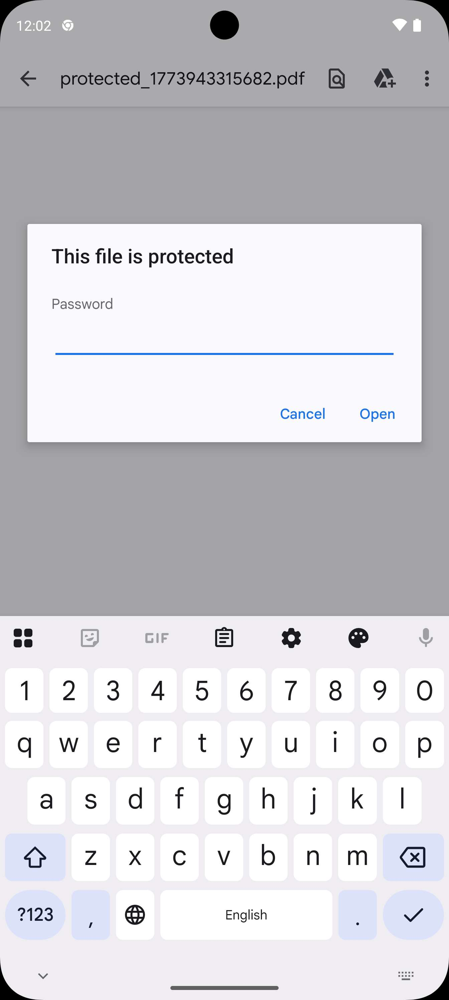
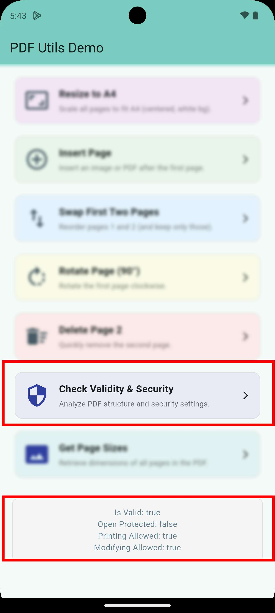

# PDF Security

`pdf_utils` provides encryption, decryption, and security permission analysis.

## Password Protection

*Figure: Encrypting and Decrypting PDFs.*

## Permission Analysis

*Figure: Checking PDF validity and detailed security permissions.*

## PDF Validity & Security Checks
Verify if a PDF is valid and see what permissions it has.

```dart
import 'package:pdf_utils/pdf_utils.dart';

void check() async {
  final validity = await PdfUtils.getValidity('/path/to/my_doc.pdf');
  
  if (validity != null) {
    print('Is Valid: ${validity.isValid}');
    print('Owner Protected: ${validity.isOwnerPasswordProtected}');
    print('Open Protected: ${validity.isOpenPasswordProtected}');
    print('Printing Allowed: ${validity.isPrintingAllowed}');
    print('Modifying Allowed: ${validity.isModifyContentsAllowed}');
  }
}
```

## Encryption
Add password protection and fine-tune your PDF permissions.

```dart
void encrypt() async {
  final encrypted = await PdfUtils.encryptPdf(
    filePath: '/path/to/my_doc.pdf',
    userPassword: 'open-password',
    ownerPassword: 'admin-password',
    allowPrinting: false,      // Prevent printing
    allowModifyContents: false, // Prevent page modifications
    allowCopy: false,          // Prevent text extraction
    useAes128: true,           // Use high-security AES encryption
  );
  
  if (encrypted != null) {
    print('Encrypted PDF saved at: ${encrypted.path}');
  }
}
```

## Decryption
Unlock protected PDFs with the correct password.

```dart
void decrypt() async {
  final decrypted = await PdfUtils.decryptPdf(
    '/path/to/protected_doc.pdf',
    password: 'open-password',
  );
  
  if (decrypted != null) {
    print('Unlocked PDF saved at: ${decrypted.path}');
  }
}
```
