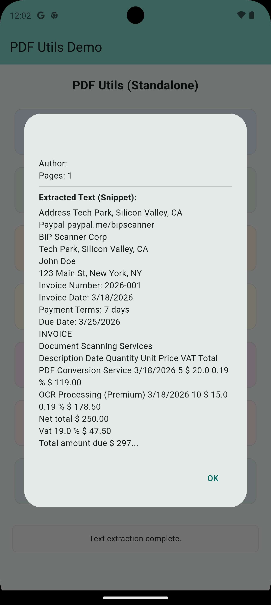

# Text Extraction

`pdf_utils` provides powerful text extraction from PDF documents using the robust PDFBox engine.


*Figure: Extracting text from specific pages or full documents.*
The `pdf_utils` plugin provides a powerful `PDFDoc` class for extracting text and metadata from PDF documents.

## PDFDoc

The `PDFDoc` class allows you to easily extract the full text of a document, text from specific pages, and important document information.

### Full Text Extraction

Extracting the full text of a PDF is simple and efficient.

```dart
import 'package:pdf_utils/pdf_utils.dart';

void extractFullText() async {
  final doc = await PDFDoc.fromPath('/path/to/my_doc.pdf');
  final text = await doc.text;
  print('Extracted Text:\n$text');
}
```

### Page Based Extraction

Extract text from a specific page or a range of pages.

```dart
// Extract from specific page
String pageText = await doc.pageAt(1).text;

// Extract from a range
String rangeText = await PdfUtils.getRangeText(
  '/path/to/my_doc.pdf',
  start: 1,
  end: 5,
);
```

### Metadata Retrieval

Retrieve important document metadata like author, title, creation date, and more.

```dart
final info = doc.info;
print('Title: ${info.title}');
print('Author: ${info.author}');
print('Creation Date: ${info.creationDate}');
print('Keywords: ${info.keywords}');
```

### Encrypted PDFs

Extracting text from protected documents is also supported.

```dart
final doc = await PDFDoc.fromPath(
  '/path/to/protected.pdf',
  password: 'my-secret-password',
);
final text = await doc.text;
```
