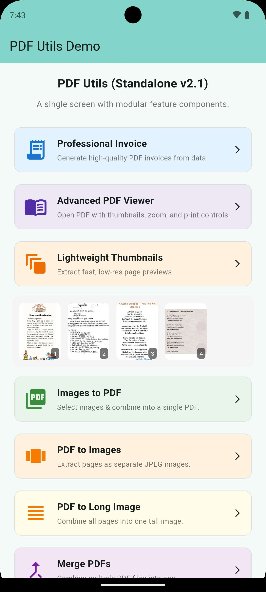

# Lightweight PDF Thumbnails

`pdf_utils` provides a specialized, high-performance engine for extracting rapid page previews.


*Figure: Lightweight page previews extracted at high speed.*

## Key Features
- **High Speed**: Optimized native implementation specifically for thumbnails.
- **Low Memory**: Adjust scale and quality to fit your UI needs.
- **Selective Extraction**: Extract a single page, a range, or the full document.

## Extraction Methods
Use `getPdfThumbnails` to extract small previews:

```dart
final thumbnails = await PdfUtils.getPdfThumbnails(
  filePath: '/path/to/large_doc.pdf',
  scale: 0.3,  // 30% of original size for speed
  quality: 50, // Moderate JPEG compression
);
```

### Specific Pages
```dart
// Single page (1-indexed)
final single = await PdfUtils.getPdfThumbnails(
  filePath: '/path/to/doc.pdf',
  page: 5,
);

// Specific range
final range = await PdfUtils.getPdfThumbnails(
  filePath: '/path/to/doc.pdf',
  range: [1, 3, 5, 8],
);
```

### Implementation Tip
The extracting engine is powered by native `PdfRenderer` (Android) and `PDFKit` (iOS), which is significantly faster than using heavyweight conversion libraries for small previews. 
It effectively renders the PDF to a small bitmap buffer and saves it to a temporary directory for efficient UI usage.
