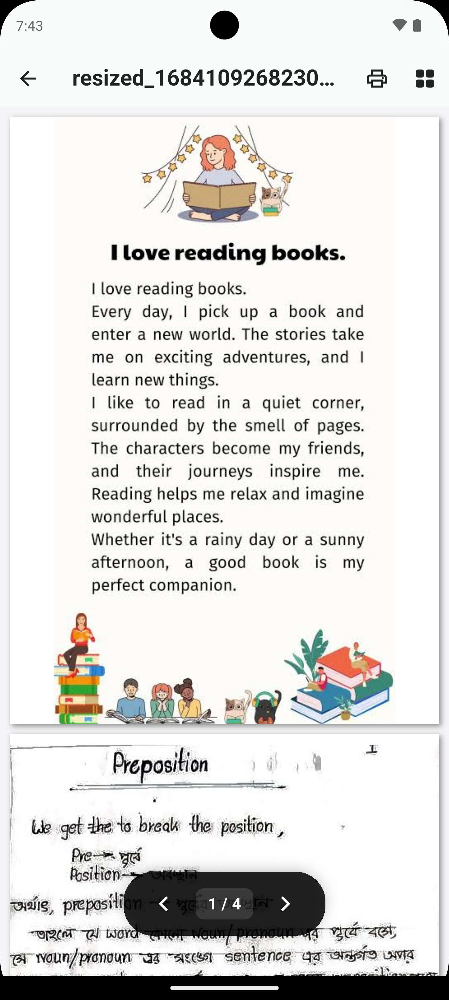

# Advanced PDF Viewer (BipPdfViewer)

`pdf_utils` provides a high-level, feature-rich PDF Viewer with a premium native feel and advanced navigation controls.


*Figure: BipPdfViewer with Thumbnail navigation and Page Indicator.*

## Key Features
- **Thumbnail Outline**: Rapidly browse through all pages using a sleek thumbnail grid.
- **Floating Controls**: Minimalist floating page indicator with precision navigation buttons.
- **Progress Indicator**: Visual feedback of your current position in the document.
- **Native Printing**: Integrated system print dialog access.
- **Customizable Theme**: Pass any primary color to match your app's branding.

## Basic Usage

```dart
import 'package:pdf_utils/pdf_utils.dart';

void openMyPdf(BuildContext context, String path) {
  Navigator.push(
    context,
    MaterialPageRoute(
      builder: (context) => BipPdfViewer(
        filePath: path,
        title: 'Report 2024.pdf',
        themeColor: Colors.deepPurple, // Optional branding
      ),
    ),
  );
}
```

## Advanced Customization
You can toggle specific viewer features:

```dart
BipPdfViewer(
  filePath: '/path/to/doc.pdf',
  showPrint: false,      // Hide print button
  showThumbnails: true,  // Show thumbnail drawer
)
```

### Technical Note
The viewer utilizes the lightweight `getPdfThumbnails` engine to load previews in the background, ensuring smooth scrolling even in large documents.
