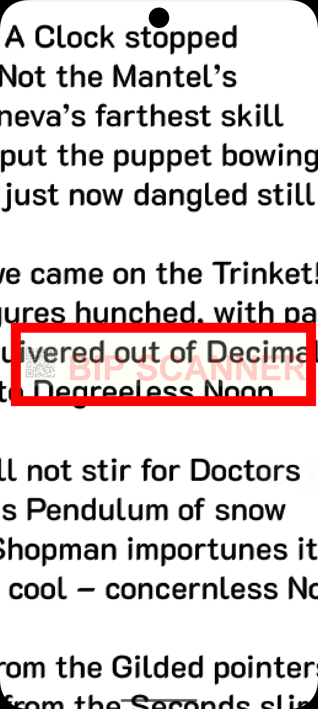

# Advanced Watermarking

`pdf_utils` allows you to brand your documents with highly customizable text and image watermarks.


*Figure: Custom watermarks with text, opacity, and logo placement.*

## New Features (v3.2.1+)
- **Inline Images**: Embed your logo using the `{image}` tag.
- **Opacity**: Control transparency (0.0 to 1.0).
- **Custom Positioning**: Use a 9-grid system or specify exact coordinates.
- **Backgrounds**: Draw a colored rectangular plate behind the watermark.

## Placements
Supported values via **`PdfWatermarkPlacement`** enum:
- `topLeft`, `topCenter`, `topRight`
- `centerLeft`, `center`, `centerRight`
- `bottomLeft`, `bottomCenter`, `bottomRight`
- `custom` (requires `customX` and `customY`)

## Basic Text Watermark
```dart
final watermarked = await PdfUtils.addWatermark(
  filePath: '/path/to/doc.pdf',
  text: 'CONFIDENTIAL',
  color: '#FF0000', // Red
  opacity: 0.1,
  placement: PdfWatermarkPlacement.center,
);
```

## Advanced Branding (Text + Image)
Insert a logo and text with a background strip.

```dart
final branded = await PdfUtils.addWatermark(
  filePath: '/path/to/doc.pdf',
  text: '{image} Branded Report by BipScanner',
  imagePath: '/path/to/logo.png',
  backgroundColor: '#FFFF00', // Yellow strip
  fontSize: 20,
  opacity: 0.2,
  placement: PdfWatermarkPlacement.bottomRight,
);
```

### Key Notes
- `color` and `backgroundColor` use Standard Hex strings (`#RRGGBB`).
- Images under the `{image}` tag are automatically scaled to the `fontSize` height while maintaining aspect ratio.
- Opacity affects the entire watermark layer.
